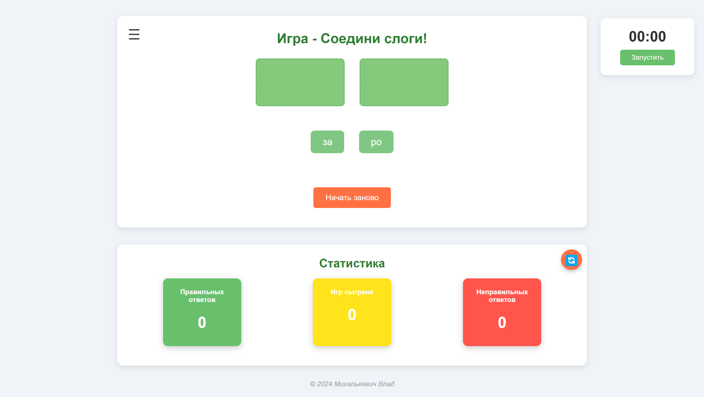

# Обучающая игра для детей "Собери слово"

[Попробовать игру](https://mihalkevitc.github.io/Words_game/)

Это интерактивная игра, созданная для помощи детям в обучении чтению. Игра использует механизм перетаскивания (Drag-and-Drop), чтобы сделать процесс обучения увлекательным и простым.

## Цель игры
Помочь детям научиться читать, составляя слова из слогов в игровой форме.

## Правила игры
1. Перетащите блоки со слогами в пустые мигающие блоки, чтобы составить слово.
2. Если слово составлено правильно, появится сообщение: **"Поздравляю! Ты составил слово {...}!"**
3. Если слово составлено неправильно, появится сообщение: **"Не получилось... Но ты сможешь! Попробуй ещё раз! Вперёд!"**
4. Чтобы начать заново, нажмите кнопку **"Начать заново"**.

## Статистика
Игра ведёт статистику, которая отображает:
- Количество правильных ответов.
- Количество сыгранных игр.
- Количество неправильных ответов.

Чтобы сбросить статистику, нажмите кнопку сброса в правом верхнем углу блока статистики. Появится модальное окно для подтверждения действия.

## Таймер
Игра также включает таймер. При вызове модального окна для подтверждения сброса статистики таймер автоматически останавливается и возобновляется после закрытия окна.

## Стек технологий
- **Frontend**: HTML, CSS, JavaScript.
- **Фреймворки**: Bootstrap.
- **Дополнительно**: PWA (Progressive-Web-App), Drag-and-Drop.

## Особенности
- **PWA**: Игра работает оффлайн и может быть установлена на мобильные устройства.
- **Drag-and-Drop**: Удобный для детей механизм перетаскивания.
- **Адаптивный дизайн**: Игра корректно отображается на различных устройствах.

## Скриншоты

